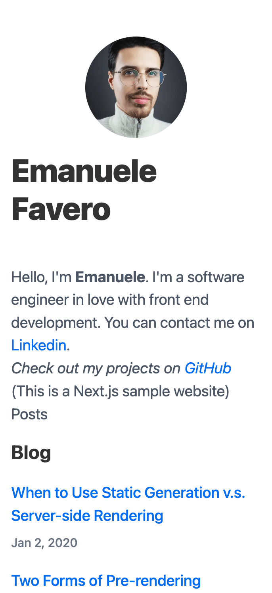

# NextJS Blog Typescript

> This is the Typescript version of the [NextJS Blog App](https://github.com/emanuelefavero/nextjs-blog)

A simple blog built with NextJS and Typescript to show its features

## Demo

[https://nextjs-blog-typescript-rho.vercel.app/](https://nextjs-blog-typescript-rho.vercel.app/)

#### Screenshot

## Run App Locally

- clone repo
- `cd` into repo
- run `npm install`
- run `npm run dev`

## **Typescript in NextJS**

- [NextJS Typescript Cheat Sheet](https://github.com/emanuelefavero/nextjs-typescript)
- [NextJS Typescript Docs](https://nextjs.org/docs/basic-features/typescript)

#### Create a new NextJS App with TypeScript and ESLint

- `npx create-next-app APP-NAME --typescript --eslint`

## Features

- Use markdown files to create blog posts
- Parse markdown files using `gray-matter` and `remark`
- Display blog posts on home page and on their own page
- Sort blog posts by date
- Style blog posts using TailwindCSS and Sass

## Technologies used in this project

- [NextJS](https://nextjs.org/)
- [**Typescript**](https://www.typescriptlang.org/)
- [React](https://reactjs.org/)
- [TailwindCSS](https://tailwindcss.com/)
- [Sass](https://sass-lang.com/)
- [postcss](https://postcss.org/)
- [autoprefixer](https://www.npmjs.com/package/autoprefixer)
- [date-fns](https://date-fns.org/)
- [gray-matter](https://www.npmjs.com/package/gray-matter)
- [remark](https://www.npmjs.com/package/remark)

## License

- [MIT](LICENSE.md)

&nbsp;

---

&nbsp;

[**Go To Top &nbsp; ⬆️**](#demo)
